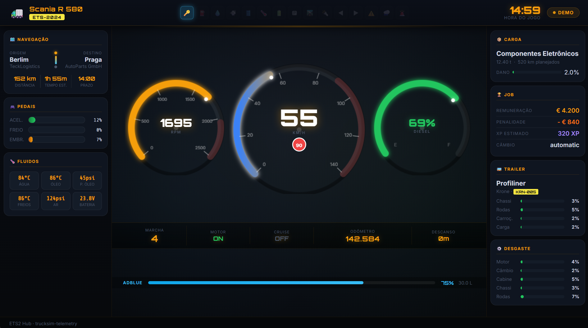

# 🚛 ETS2 Hub — Dashboard de Telemetria

Um hub de informações em **tempo real** para o **Euro Truck Simulator 2** e **American Truck Simulator**, exibindo dados do jogo em um dashboard estilo painel de caminhão diretamente no navegador.



---

## ✨ Funcionalidades

| Painel | Informações |
|--------|-------------|
| 🎛️ **Cluster de Instrumentos** | Velocímetro, tacômetro e indicador de combustível — gauges circulares analógicos |
| 🗺️ **Navegação** | Origem, destino, distância, tempo estimado e prazo de entrega |
| 🎮 **Pedais ao Vivo** | Barras de acelerador, freio e embreagem em tempo real |
| 🌡️ **Fluidos** | Temperatura da água/óleo, pressão do óleo, temperatura dos freios, pressão do ar, bateria |
| ⛽ **Combustível + AdBlue** | Nível, litros, autonomia, consumo e nível de AdBlue |
| 📦 **Carga** | Nome, peso, dano e rota da carga |
| 🏆 **Estatísticas do Job** | Remuneração, penalidade, XP estimado e câmbio |
| 🚌 **Trailer** | Marca, modelo, placa e desgaste do reboque |
| ⚙️ **Desgaste** | Motor, câmbio, cabine, chassi e rodas |
| 💡 **Luzes de Aviso** | 15 indicadores: combustível, AdBlue, ar, óleo, temperatura, bateria, pisca, farol alto e mais |

---

## 🛠️ Pré-requisitos

- [Node.js](https://nodejs.org/) v18+
- [Euro Truck Simulator 2](https://store.steampowered.com/app/227300/) ou ATS

---

## � Instalação

### 1. Clone o repositório

```bash
git clone https://github.com/SEU_USUARIO/hub_eurotruck.git
cd hub_eurotruck
```

### 2. Instale as dependências

```bash
npm install
```

### 3. Instale o plugin no ETS2 / ATS

Você precisa do plugin **SCS Telemetry** para que o jogo envie os dados:

1. Baixe o `scs-telemetry.dll` em: https://github.com/RenCloud/scs-sdk-plugin/releases
2. Copie o arquivo para a pasta de plugins do jogo:
   - **ETS2 (64-bit):** `Steam\steamapps\common\Euro Truck Simulator 2\bin\win_x64\plugins\`
   - **ATS (64-bit):**  `Steam\steamapps\common\American Truck Simulator\bin\win_x64\plugins\`
   
   > 💡 Se a pasta `plugins` não existir, crie-a manualmente.

3. Inicie o jogo no **modo 64-bit**

### 4. Inicie o servidor

```bash
node server.js
```

### 5. Acesse o dashboard

Abra no navegador:
```
http://localhost:3000
```

---

## 📱 Acesso pelo Tablet / Celular

O hub funciona em qualquer dispositivo na **mesma rede Wi-Fi**!

1. Descubra o IP do seu PC:
   ```bash
   ipconfig
   ```
2. Acesse no dispositivo:
   ```
   http://SEU_IP_LOCAL:3000
   ```
   Exemplo: `http://192.168.1.100:3000`

> ⚠️ Pode ser necessário liberar as portas **3000** e **3001** no Firewall do Windows.

---

## � Estrutura do Projeto

```
hub_eurotruck/
├── server.js          # Backend Node.js (WebSocket + Telemetria)
├── package.json
├── assets/
│   └── HUB_ETS_ATS.png
└── public/
    ├── index.html     # Estrutura do dashboard
    ├── style.css      # Tema dark — estilo painel de caminhão
    └── app.js         # Cliente WebSocket + renderização dos gauges
```

---

## 🔧 Como funciona

```
ETS2/ATS → scs-telemetry.dll → Memória Compartilhada
                                        ↓
                             trucksim-telemetry (npm)
                                        ↓
                              server.js (Node.js)
                           ┌───────────┴───────────┐
                      HTTP (3000)           WebSocket (3001)
                           ↓                        ↓
                     index.html               app.js (live data)
```

---

## 📄 Licença

MIT — sinta-se à vontade para usar, modificar e distribuir.
